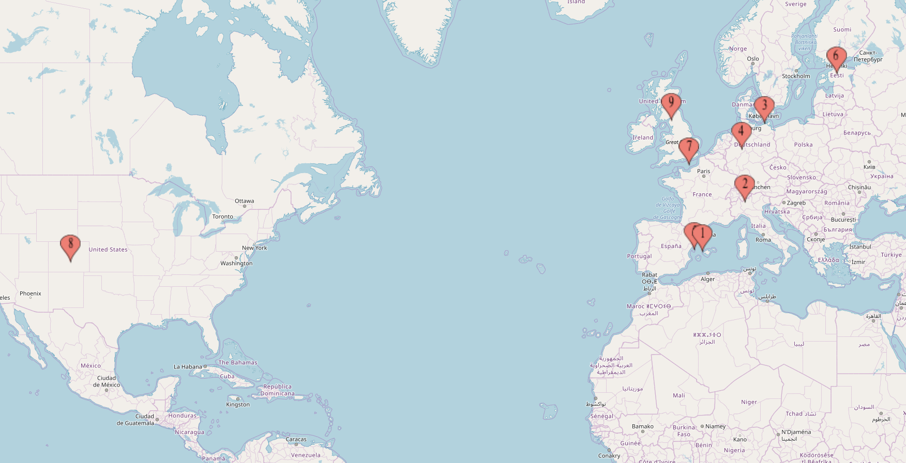

# Hackathons

I have attended 30 hackathons. 21 as participant, 5 as organizer, 2 as sponsor, 1 as speaker, 1 as judge. Here is a list of them:

| #    | Name                          | Role      | Location                         | Date       | Info                                                         |
| :--- | :---------------------------- | :-------- | :------------------------------- | :--------- | :----------------------------------------------------------- |
| 01   | HackUPC 2016                  | Hacker    | Barcelona, Catalonia             | 2016/02/19 | This was my first hackathon ever. We didn't make any project but it was fun for starting in this world. |
| 02   | HackUPC Fall 2016             | Organizer | Barcelona, Catalonia             | 2016/10/07 | First hackathon as an organizer. Full stress and a lot of things I learnt from that weekend. I started loving this world. |
| 03   | HackUPC Winter 2017           | Organizer | Barcelona, Catalonia             | 2017/03/03 | The hackathon where I matured in this field. This hackathons made a difference. |
| 04   | START Hack 2017               | Hacker    | St. Gallen, Switzerland          | 2017/03/17 | In this hackathon we did [PayTrack](https://devpost.com/software/paytrack), an Android app which takes your latest transactions when traveling abroad to determine places to eat, visit, shop.. in order to help you with your budget. |
| 05   | CopenHacks 2017               | Hacker    | Copenhagen, Denmark              | 2017/04/22 | We built [CityFind](https://devpost.com/software/cityfind), a funny way to discover the city using Image Recognition. |
| 06   | HackUPC Fall 2017             | Organizer | Barcelona, Catalonia             | 2017/10/13 | I had the pleasure to co-direct this edition of HackUPC increasing the number of hackers from 500 to 700. |
| 07   | HackUPC 2018                  | Organizer | Barcelona, Catalonia             | 2018/10/19 | This was the last edition as organizer working as Sponsorship director where we achieved the biggest budget ever in HackUPC. |
| 08   | jacobsHack! 2018              | Hacker    | Bremen, Germany                  | 2018/11/03 | In this hackathon we worked on [Tag&Find](https://devpost.com/software/tag-find), a place finder using NLP. We won two prizes: Best project using Here.com's API and third place in most disruptive project. |
| 09   | HackEPS 2018                  | Hacker    | Lleida, Catalonia                | 2018/11/17 | We created [Hubder](https://devpost.com/software/hubder), a final thesis finder using Tinder strategy. |
| 10   | Junction 2018                 | Hacker    | Helsinki, Finland                | 2018/11/23 | One of the coolest projects that I've worked, [WeatherPlayer](https://github.com/AlbertSuarez/weather-player). A music playlist generator using weather and mood data. We achieved the 2nd place in the Vaisala challenge. |
| 11   | Royal Hackaway v2             | Hacker    | London, England                  | 2019/02/02 | In this hackathon we did [Trippify](https://devpost.com/software/trippify), a web app that allows you to create an event in order to share it with your friends and organize all the trip distribution. We got the 3rd overall place. |
| 12   | HackCU Episode V              | Hacker    | Boulder, USA                     | 2019/02/23 | My first experience in a US hackathon. We built [Food Lord](https://devpost.com/software/food-lord), a calories calculator using Computer Vision. |
| 13   | Hack The Burgh 2019           | Hacker    | Edinburgh, Scotland              | 2019/03/16 | The most useful project that I've ever built, [UnstuckOverflow](https://devpost.com/software/un-stuckoverflow). A Chrome extension allows you to stay in contact with someone on your company who can help you whenever you are facing some index out of bounds errors. We won two prizes: 2nd overall place and best project hosted in a Domain.com. |
| 14   | CopenHacks 2019               | Hacker    | Copenhagen, Denmark              | 2019/04/06 | One of the most complex project that I've been working on, [Donework](https://github.com/AlbertSuarez/donework). A content generator given a table of contents using Machine Learning and search similarity. |
| 15   | eCooltra hackathon            | Hacker    | Barcelona, Catalonia             | 2019/05/03 | My first company hackathon in the middle of Barcelona where we built [weCooltra](https://github.com/AlbertSuarez/weCooltra), a new version of the current application gamificating it. We won the hackathon getting the 1st overall place. |
| 16   | HackNLP                       | Hacker    | Barcelona, Catalonia             | 2019/05/18 | An small hackathon in the UPC focused in NLP where we built a better algorithm for creating clusters of duplicate requirements, [Similaripy](https://github.com/adriacabeza/similaripy). We got the 1st place winning the hackathon. |
| 17   | PyTorch hackathon             | Hacker    | Online                           | 2019/09/16 | An online hackathon run by PyTorch and sponsored by Facebook. We developed [ObjectCut](https://github.com/AlbertSuarez/object-cut), a project that given an image crops the objects that you specify automagically. |
| 18   | MamutHack 2019                | Hacker    | Cerdanyola del Valles, Catalonia | 2019/10/05 | First edition of a hackathon at UAB with around 90 hackers there. We built [Git Inspect](https://github.com/AlbertSuarez/git-inspect), a project that extracts all the public information from a GitHub user generating a cool analytics page, even a Spotify playlist based on your commits. |
| 19   | HackUPC 2019                  | Sponsor   | Barcelona, Catalonia             | 2019/10/11 | First time attending to a hackathon as sponsor representing [Restb.ai](https://restb.ai). It was cool to come back to my home hackathon with this new and different role. |
| 20   | LauzHack 2019                 | Hacker    | Lausanne, Switzerland            | 2019/11/16 | We used this hackathon for building a project that we wanted to do for a long time ago: [EasyCam](https://devpost.com/software/easycam). Webapp for sharing your DSLR camera images without cables quickly to Social Media. |
| 21   | bitsxLaMarato 2019            | Organizer | Barcelona, Catalonia             | 2019/12/13 | I helped organizing this supportive hackathon against rare diseases for La Marató de TV3. 26 projects were built and we collected +2k€ on donations during that weekend. |
| 22   | Hack The Burgh 2020           | Hacker    | Edinburgh, Scotland              | 2020/02/29 | We took advantadge of this hackathon for bulding [EyeTales](https://github.com/joelmoff/eye-tales), a tool that helps blind people by describing them their environment. We ranked as the best project using Transloadit API. |
| 23   | HackFromHome Round 1          | Speaker   | Online                           | 2020/03/21 | I had the pleasure to my first online workshop in this 12h hackathon. I presented a session about [building APIs using Flask with OpenAPI](https://github.com/hackupc/hackfromhome-talks). |
| 24   | COVID-19 Global Hackathon 1.0 | Hacker    | Online                           | 2020/03/26 | Taking advantage of the lockdown situation and wanting to experiement a bit with scraping and Twitter bots, I built an [small bot](https://devpost.com/software/covid19-bot) for tracking Coronavirus cases, deaths and recoveries. |
| 25   | HackFromHome Round 2          | Hacker    | Online                           | 2020/04/04 | After doing a workshop in the past round, I wanted to build something fun in this short-period hackathon. That's why I built [Which dog are you?](https://devpost.com/software/which-dog-are-you), a dog and face person matcher based on image similarity. |
| 26   | Hackovid                      | Hacker    | Online                           | 2020/04/06 | In this hackathon from the Government of Catalonia, organized by I2Cat, we built [Compra Local](https://github.com/carlotacb/compra-local), a web application for activating local businesses and making your neighborhood a better place. We ended up ranking in the postion 19 out of 61 projects. |
| 27   | HackEPS 2020                  | Hacker    | Online                           | 2020/11/28 | In this hackathon, which I worked solo, I built [3D Net](https://github.com/AlbertSuarez/3d-net), a classification neural network able to classify a group of STL files, representing a 3D model, in one of the 66 category that the model has. I achieved the 1st place in best programming practices along with the 2nd place in the Invelon challenge. |
| 28   | bitsxLaMarato 2020            | Hacker    | Online                           | 2020/12/19 | In this hackathon, focused in Covid-19, our team built [CaseScan](https://github.com/AlbertSuarez/casescan), a web application that searches for clinical cases by similarity specialized in Covid-19. |
| 29   | HackUPC 2021                  | Judge     | Online                           | 2021/05/14 | First time attending to a hackathon as judge for the hackathon first jury in order to decide the 5 finalists. It was cool to come back to my home hackathon with this new and different role, even though it was online. |
| 30   | HackUPC 2022                  | Sponsor   | Barcelona, Catalonia             | 2022/04/29 | In the same way as 2019, back to HackUPC representing [Restb.ai](https://restb.ai). |
| 31   | HackUPC 2023                  | Sponsor   | Barcelona, Catalonia             | 2023/05/12 | In the same way as 2019 & 2022, back to HackUPC representing [Restb.ai](https://restb.ai). |
| 32   | HackEPS 2023                  | Sponsor   | Lleida, Catalonia                | 2023/11/25 | For the first time, sponsoring the Lleida hackathon representing [Restb.ai](https://restb.ai). |
| 33   | Datathon FME 2024             | Sponsor   | Barcelona, Catalonia             | 2024/11/16 | For the first time, sponsoring a Datathon representing [Restb.ai](https://restb.ai). |
| 34   | HackEPS 2025                  | Sponsor   | Lleida, Catalonia                | 2025/11/22 | For the second time, sponsoring the Lleida hackathon representing [Restb.ai](https://restb.ai). |

Please feel free to fork the [original repo](https://github.com/abdulajet/hackathons) and start your own list!
